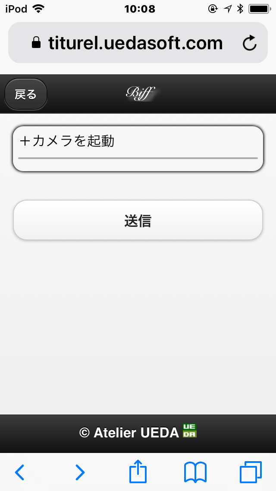
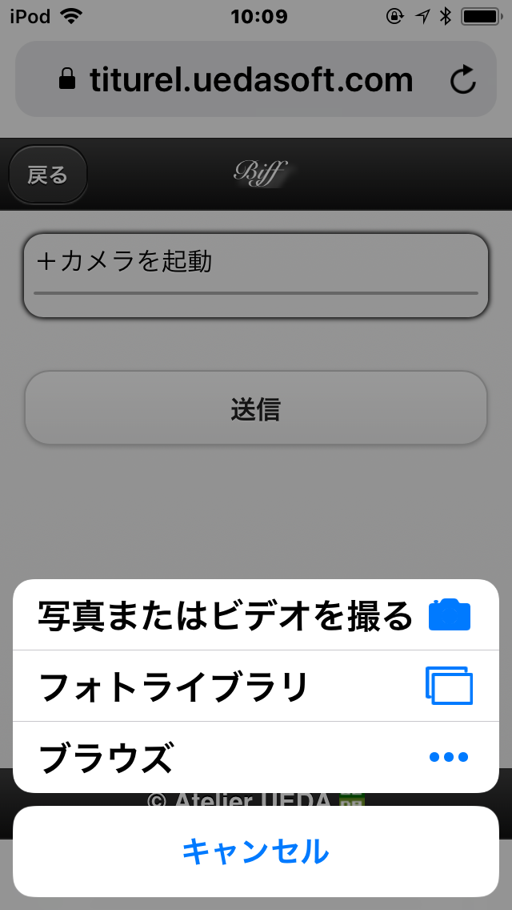
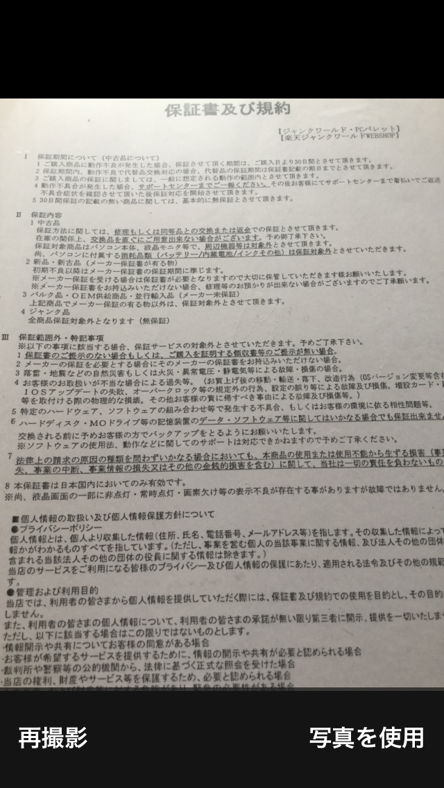
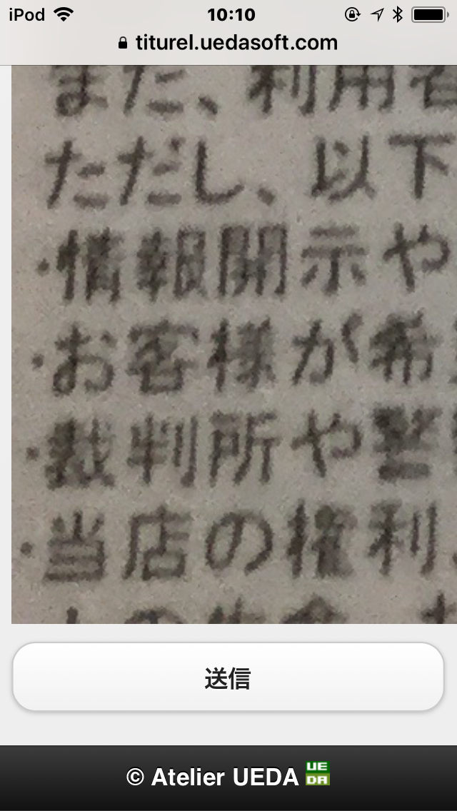
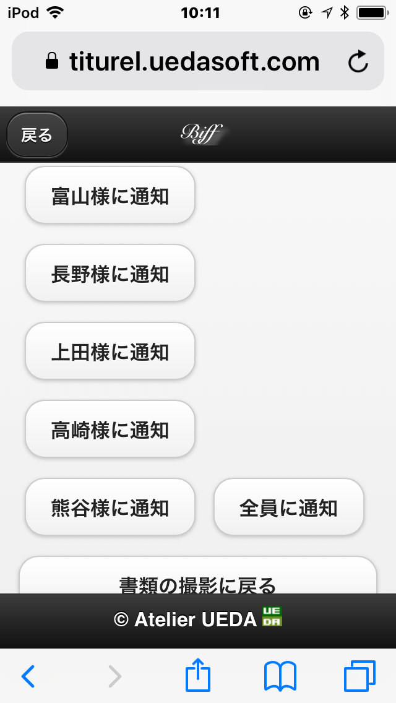

# biff - postoffice mail notifier
A webservice to send notification mail of a paper mail delivered to an out of office staff.

## For whom the biff is ?

This is for a person who tend to be out of office few day's in a low. For these persons, a paper mail tend be troublesome. First of all, no way to notice the delivery, despite some of these paper mail expect to be processed within a tight due date. However, go back to office every day is not efficient working style, and asking colleague to tell all delivery of paper mail every day is also awkward even giving many reward.

## How the biff work ?

The biff work as decrease the awkwardness of asking colleague to tell paper mail delivery by providing easy way to do this.  
The biff is a web application. Go to the biff web app with your mobile, then the page that encourage taking a photo is coming as follows:

take a photo of delivered paper mail & notify it by email to an out of office staff for his/her making decision of return back office soon to take care it by urgent or taking high priority of current task at outside and taking care the mail tommorow.
This project must be so helpful for the capable sales person, tough engineer woarking at a field, and all of the outside working person to work more efficiently!

## How to use
