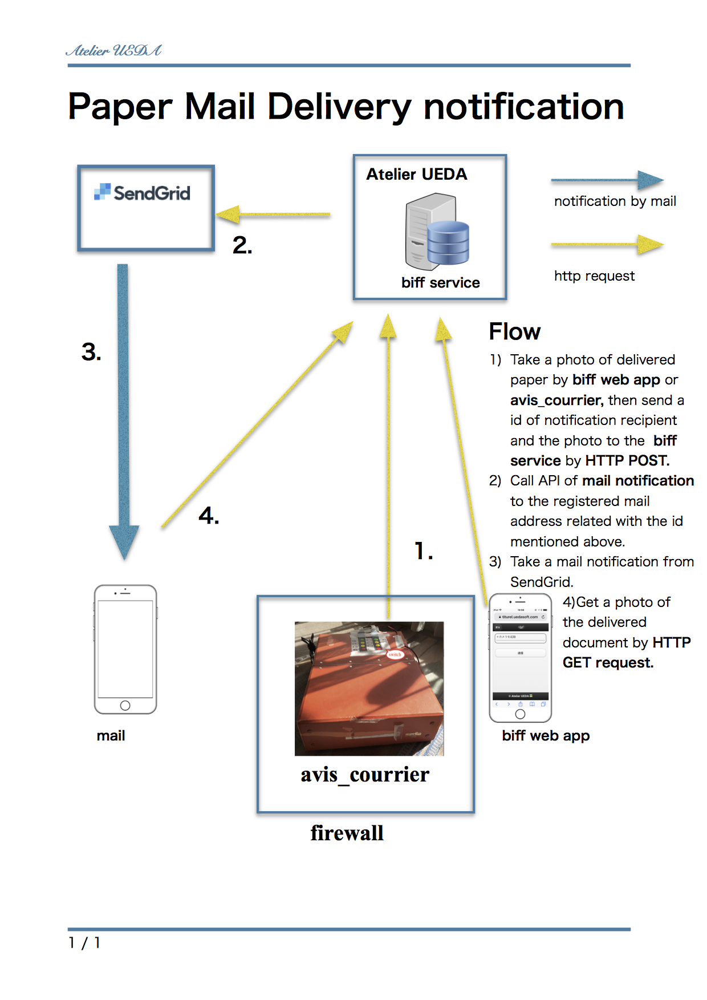

# biff - postoffice mail notifier
A webservice to send notification mail of a paper mail delivered to an out of office staff.

## For whom the biff is ?

This is for a person who tend to be out of office few day's in a low. For these persons, a paper mail tend be troublesome. First of all, no way to notice the delivery, despite some of these paper mail expect to be processed within a tight due date. However, go back to office every day is not efficient working style, and asking colleague to tell all delivery of paper mail every day is also awkward even giving many reward.

## How the biff work ?

The biff work as decrease the awkwardness of asking colleague to tell paper mail delivery by providing easy way to do this.  
The biff is a web application. Go to the biff web app with your mobile, then the page that encourage taking a photo is coming as follows:

  
  

So, take a photo of delivered mail and click "送信" button to send it to server:

  
  

Then, the registered receiver list is comming.

So, click the button of receiver, then the notification mail is sent to the receiver.
The contents of notification mail has link to the posted photo, so receiver can confirm what paper is delivered.

## configration

In above figure, the ***[avis_courrier](https://github.com/UedaTakeyuki/avis_courrier)*** is a document box connected with biff.
